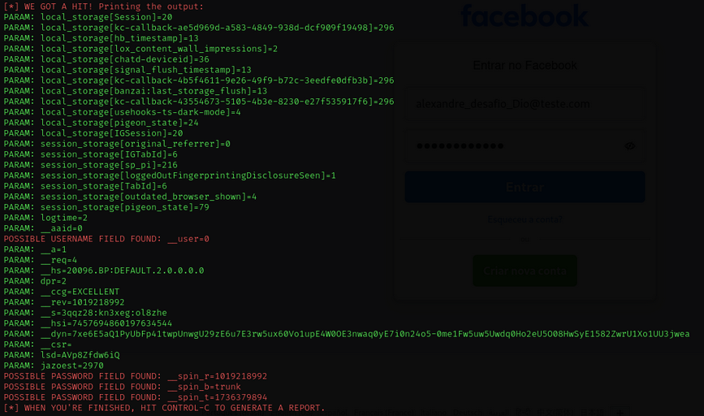
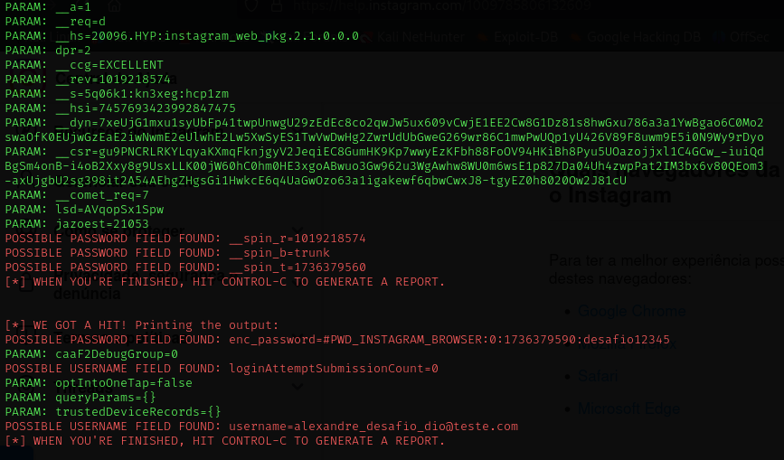
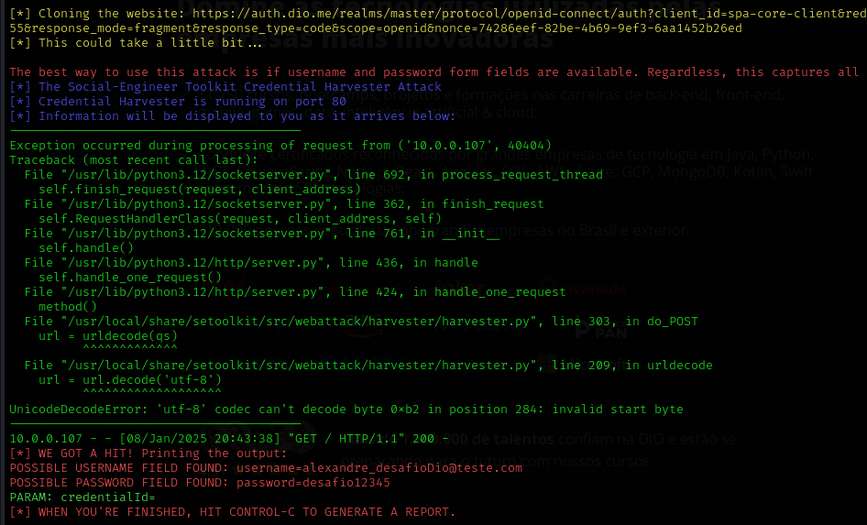

# Phishing para captura de senhas do Facebook

### Ferramentas

- Kali Linux
- setoolkit

### Configurando o Phishing no Kali Linux

- Acesso root: ``` sudo su ```
- Iniciando o setoolkit: ``` setoolkit ```
- Tipo de ataque: ``` Social-Engineering Attacks ```
- Vetor de ataque: ``` Web Site Attack Vectors ```
- Método de ataque: ```Credential Harvester Attack Method ```
- Método de ataque: ``` Site Cloner ```
- Obtendo o endereço da máquina: ``` ifconfig ```
- URL para clone: http://www.facebook.com
- URL para clone: http://www.instagram.com
- URL para clone: http://www.dio.me.com

- A atividade proposta no desafio deveria ser realizada no URL "http://www.facebook.com" porém não funcionou, fiz 2 reinstalações do Kali Linux, foi necessario instalar pacotes adicionais para finalizar a instalação do setoolkit, precisei instalar o "Venv e o Pip3" para criar um ambiente isolado para o setoolkit, só assim consegui finalizar a instalação do pacote.
Contudo o URL "http://www.facebook.com" continuava não funcionando, a ferramenta não retornava os dados de login e a pagina não retornava para o URL verdadeiro, resolvi testar em outros URLs, funcionou corretamente no URL http://www.instagram.com e no URL http://www.dio.me.com

### Resutados

## Facebook


## Instagram


## Dio

